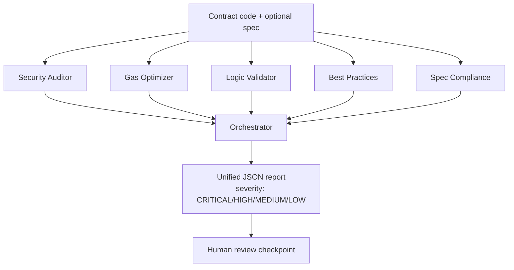

# Smart Contract Review Agent System

Multi-agent proof-of-concept for automated Solidity smart contract review, built with the Anthropic Claude API. Five specialized agents each analyze a contract from a distinct angle and return structured JSON findings; an orchestrator consolidates their output into a unified report with severity levels and a human review checkpoint.

## Architecture



### Agents

| Agent | Focus |
|---|---|
| Security Auditor | Reentrancy, overflow, access control, state management, delegatecall |
| Gas Optimizer | Storage layout, loops, memory usage, variable packing |
| Logic Validator | Specification compliance, algorithm correctness, edge cases, invariants |
| Best Practices | Naming, code organization, error handling, events, documentation |
| Spec Compliance | Formal spec validation (only runs when a spec is supplied) |

Each agent returns JSON only — no markdown, no preamble — and stays scoped to its single concern rather than acting as a general-purpose code reviewer. The orchestrator runs the agents sequentially, consolidates findings without redundancy, and writes a unified report to `reports/`.

## Repo Structure

```
contract-review-agent-system/
├── README.md
├── agents/
│   ├── security_auditor.py
│   ├── gas_optimizer.py
│   ├── logic_validator.py
│   ├── best_practices.py
│   └── spec_compliance.py
├── orchestrator.py       # main entry point
├── config.py             # API key, model config
├── test_contracts/
│   ├── simple_erc20.sol
│   ├── vulnerable.sol
│   ├── gas_inefficient.sol
│   ├── uniswap_snippet.sol
│   └── specs/
│       ├── erc20_spec.md
│       └── dex_spec.md
├── case_studies/
│   ├── case_1_erc20_audit.md
│   ├── case_2_vulnerability_detection.md
│   └── case_3_agent_direction_workflow.md
├── reports/              # orchestrator output
└── requirements.txt
```

## Usage (planned)

```bash
python orchestrator.py --contract test_contracts/vulnerable.sol --spec test_contracts/specs/erc20_spec.md
```

## Status

Phase 1 (architecture + repo scaffold) complete. Agent implementations, orchestrator logic, test contracts, and case studies are tracked in subsequent phases.
